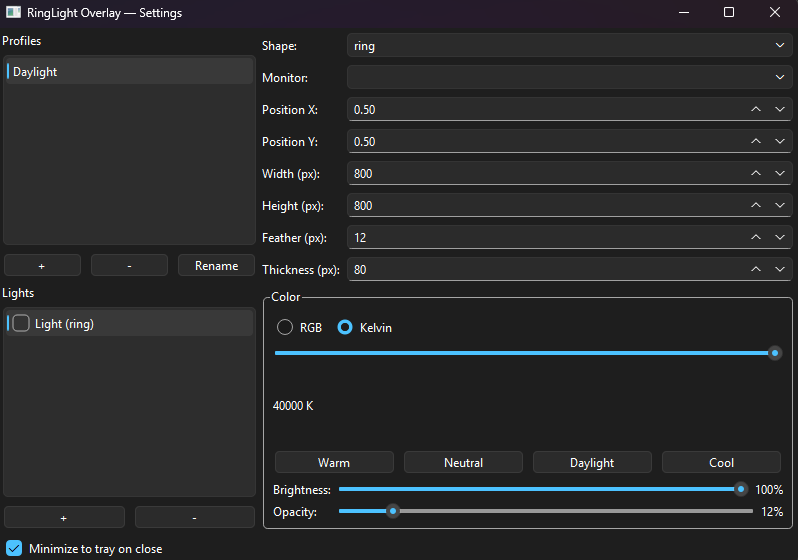
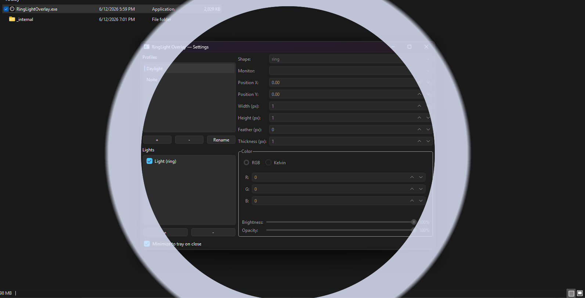

# RingLight Overlay

Transparent click-through overlay windows that simulate ring lights and softboxes on your
secondary monitors — ideal for streaming, video calls, and photography.

## Screenshots

| Settings window | Overlay on monitor |
|---|---|
|  |  |

*(Screenshots captured during the Windows smoke test; added when available.)*

## Features

- Transparent, click-through overlay rings and shapes rendered on any connected monitor
- Per-profile light configuration: color temperature (Kelvin), size, brightness, feather
- Multiple profiles with instant switching from the system tray
- Global hotkeys that work while any other app has focus
- Debounced JSON config auto-save — settings persist across restarts
- Close-to-tray behavior; graceful shutdown with state flush
- First-run default "Daylight" profile; tray balloon on first launch
- Distributable one-folder build — no Python installation required on end-user machines

## Requirements

- Windows 11 x64 (Windows 10 may work; not officially tested)
- No Python installation needed when using the packaged build

## Run from source

```powershell
python -m venv venv
.\venv\Scripts\Activate.ps1
pip install -r requirements.txt
python -m ringlight_overlay
```

## Build a standalone package

```powershell
.\venv\Scripts\Activate.ps1
pip install -r requirements-dev.txt
pyinstaller --noconfirm RingLightOverlay.spec
# or use the helper script:
.\scripts\build.ps1
```

The output is in `dist\RingLightOverlay\`. Zip it for distribution or run
`RingLightOverlay.exe` directly. Target install size is under 130 MB (full PySide6 bundle).

A pre-built zip artifact is produced automatically by the [build workflow](.github/workflows/build.yml)
on every `v*` tag push and is downloadable from the GitHub Actions run page.

## Default hotkeys

| Action | Default shortcut |
|---|---|
| Toggle all lights on/off | `Ctrl+Alt+L` |
| Brightness up (+5%) | `Ctrl+Alt+Up` |
| Brightness down (−5%) | `Ctrl+Alt+Down` |
| Next profile | `Ctrl+Alt+Right` |
| Previous profile | `Ctrl+Alt+Left` |
| Show settings window | `Ctrl+Alt+S` |

Hotkeys fire globally — they work while any other application has focus.

## Manual smoke checklist (SPEC §10)

Run these steps on a clean Windows 11 machine using the packaged build before shipping:

- [ ] Light renders correctly on each connected monitor
- [ ] Click-through: clicking the overlay passes focus to the app underneath
- [ ] Overlay stays topmost over Chrome borderless-fullscreen and OBS
- [ ] Profile switch updates lights without flicker
- [ ] Hotkeys fire while focus is on another app
- [ ] App restart restores the last active profile and window position
- [ ] Connect and disconnect a monitor while running — no crash; overlay re-snaps
- [ ] Tray shows the `favicon.ico` icon (not the orange placeholder)
- [ ] `dist/RingLightOverlay` total size is under 130 MB
- [ ] Screenshots captured and saved to `docs/screenshots/`
